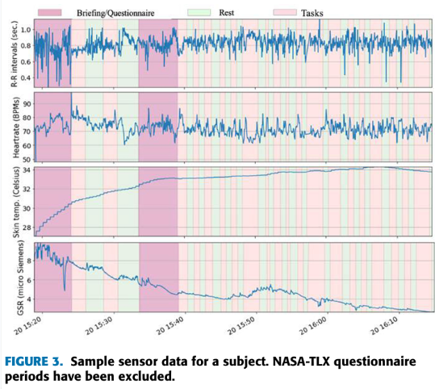
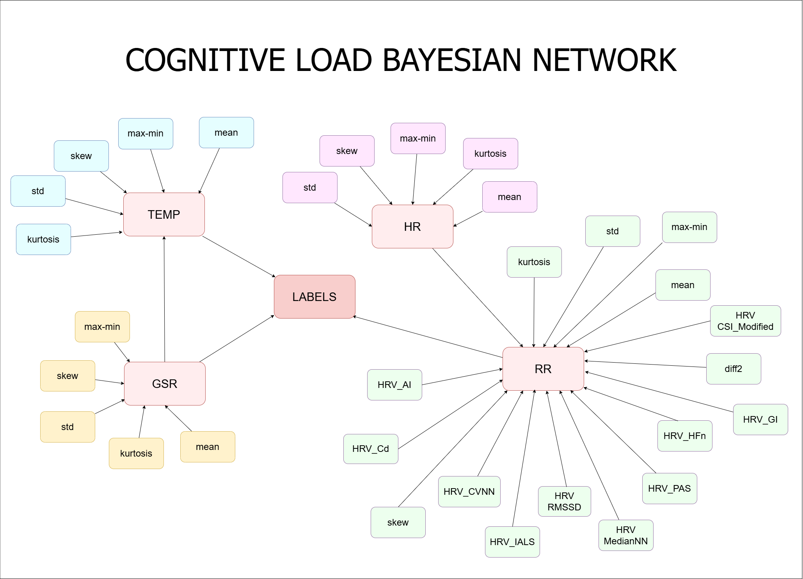

# **Cog_BayesNetwork**  
## Authors
<table>
  <tr>
    <th>Research Advisor</th>
    <th>Conducted by</th>
  </tr>
  <tr>
    <td>Dr. Nguyễn Quốc Huy</td>
    <td>Đỗ Minh Quân</td>
  </tr>
  <tr>
    <td>Dr. Đỗ Như Tài</td>
    <td>Lê Thị Mỹ Hương</td>
  </tr>
  <tr>
    <td></td>
    <td>Trần Bùi Ty Ty</td>
  </tr>
</table>

## **About My Data**  
- Includes three directories *23_objects**, **allFeatures**, **last_30s_segments**):  
  + **23_objects**: Raw data from 23 subjects recorded during data collection.  
  + **allFeatures**: Contains **statFeatures.csv** and **features.csv**.  
    - **statFeatures.csv**: Includes 10 basic statistical features rferenced from the original paper's source: [Colab_part-1]htps://colab.research.google.com/drive/1adYKWqgSsky0z5LITB9QjsFTmL7g90gH?usp=sharing)), such as mean, standard deviation, skewness, kurtosis, diff, diff², 25th quantile, 75th quantile, qdev, and max-min.  
    - **allFeatures.csv**: Contains both basic statistical features and expert features rferenced from the original paper's source: [Colab_part-2]htps://colab.research.google.com/drive/1adYKWqgSsky0z5LITB9QjsFTmL7g90gH?usp=sharing)).  
  + **last_30s_segments** *Main working dataset**): Includes physiological signals *GSR, HR, RR, Temp**) extracted from the last 30 seconds of each signal along with label information *Rest/Load**).  
- After preprocessing, the data was adjusted to fit the **Bayesian Network model**, and all datasets were uploaded to **[DATASET]htps://www.kaggle.com/datasets/quanminhminhquan/cognitiveload)**.  

## **Purpose**  
- Develop a **Bayesian Network model** based on selected features to improve the classification performance of cognitive load signals. The study focuses on exploring the relationships between physiological signals *RR, GSR, HR, Temp**) and cognitive load states *Rest/Load**) using a  **Bayesian Network model**.  

  
  

  

## **Research Approach**  
  + **Analysis and evaluation of existing methods**: Examine and assess traditional models such as **SVM, Random Forest, Gradient Boosting, CNN, RNN, etc.**, to identify optimal methods for cognitive load signal classification.  
  + **Developing a new approach**: Propose a **Bayesian Network model**, where physiological signals *RR, GSR, HR, Temp**) act as **parent nodes**, extracted features are **child nodes**, and the classification labels *Rest/Load**) represent the **output**.  
  + **Experimentation and evaluation**: Evaluate the performance of the **Bayesian Network model** to determine its applicability in cognitive load classification.  

## **Result**  
- The final outcome of the study is a **Bayesian Network model** along with its **Conditional Probability Distributions CDs)**, representing the causal relationships between physiological signals *RR, GSR, HR, Temp**) and cognitive load states *Rest/Load**).  
- The learned Bayesian structure illustrates **dependencies between features**, providing insights into how different physiological signals contribute to cognitive load classification.  
- The **CPDs quantify the probabilistic influence** of each feature on the classification outcome, allowing for interpretable decision-making and uncertainty estimation in real-world applications.  
- The learned Bayesian Network reveals that **RR plays a central role** in the physiological relationship network, while **GSR and Temp serve as supporting features** in cognitive load classification.  
- Comparative evaluation shows that the **Bayesian Network model achieves competitive classification performance**, while also offering the advantage of **interpretable causal relationships** over black-box machine learning models.  

  
  <table>
  <tr>
    <th>gsr_features</th>
    <th>rr_features</th>
    <th>temp_features</th>
    <th>rest</th>
    <th>load</th>
  </tr>
  <tr>
    <td>0</td>
    <td>0</td>
    <td>0</td>
    <td>0.3194</td>
    <td>0.6806</td>
  </tr>
   <tr>
    <td>0</td>
    <td>0</td>
    <td>1</td>
    <td>0.4310</td>
    <td>0.5690</td>
  </tr>  
  <tr>
    <td>0</td>
    <td>1</td>
    <td>0</td>
    <td>0.6269</td>
    <td>0.3731</td>
  </tr>  
  <tr>
    <td>0</td>
    <td>1</td>
    <td>1</td>
    <td>0.4230</td>
    <td>0.5769</td>
  </tr>
    <tr>
    <td>1</td>
    <td>0</td>
    <td>0</td>
    <td>0.4643</td>
    <td>0.5357</td>
  </tr>  
  <tr>
    <td>1</td>
    <td>0</td>
    <td>1</td>
    <td>0.4461</td>
    <td>0.5538</td>
  </tr>
    <tr>
    <td>1</td>
    <td>1</td>
    <td>0</td>
    <td>0.6327</td>
    <td>0.3673</td>
  </tr>
    <tr>
    <td>1</td>
    <td>1</td>
    <td>1</td>
    <td>0.6122</td>
    <td>0.3878</td>
  </tr>
</table>

  
🚀 **Future work** will focus on improving feature selection strategies, incorporating dynamic Bayesian models, and validating the approach on larger datasets for real-world deployment.
